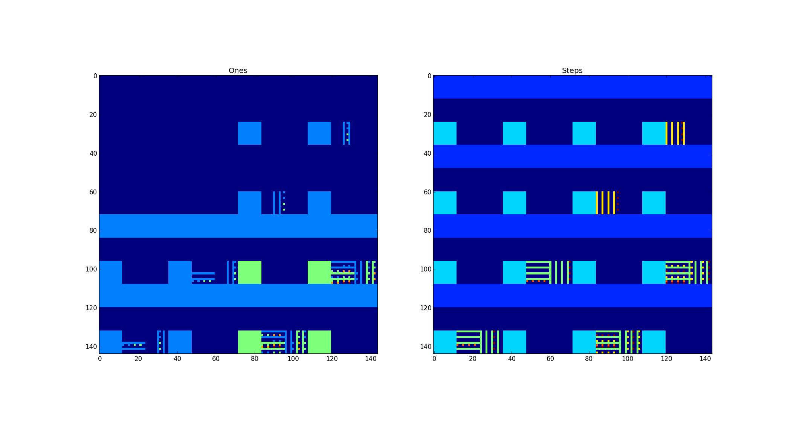

Busy Beaver
===========

Approximates the [Busy Beaver Σ-function][busybeaver], naïvely.

Σ(n) is the largest number of 1s a non-halting, n-state (and, originally,
2-symbol) Turing machine will print on its tape. They don't have to be
consecutive, but the machine *must* halt.

More interestingly, the Σ-function is non-computable. Let me explain.

To calculate Σ(n), enumerate all n-state Turing machines and run them. When a
machine halts, count the number of 1s on its tape, and remember the machine
with the most ones so far --- the champion.

But soon you will encounter a machine that doesn't seem to halt. If you can
conclusively *prove* that it will never halt, you ignore it --- Busy beaver
machines are, by definition, non-halting machines. But by the halting theorem,
you *cannot* prove that it will halt or not. You can create some clever
heuristics that will identify large classes of machines that are provably in a
loop. That is completely fine, and absolutely workable. But, you will *never*
cover all cases. So at that point, you have to bring in human operators to
investigate whether a given machine halts or not. That's also fine, but is
really just another version of the same problem. Are there machines that humans
won't be able to prove halts or not? Absolutely. I haven't seen one yet, but we
know from mathematics that there are statements that cannot be proven or
disproven. Statements that are true, but cannot be proven so.

That's why I made this program: I want to find some cool, but simple Turing
machines that I myself can't figure out will ever halt or not.

The code was featured in a [talk I held on Busy Beavers][talk].

Status
------

I'm not proving the haltedness for any machines; I'm cheating by having a table
of known S(n) values.

How to run
----------

Just type `python busybeaver.py`. It supports Python 2 and 3. Protip: Use pypy.

Plots
-----

Above I plot the number of ones and steps for all 2-state, binary Turing
Machines starting with a blank tape. Each pixel is a machine, and its color is
blue if the machine did not halt. The order stems from the way I enumerate the
transition functions, and is a bit arbitrary here (more below).

Even so, we can clearly see clusters of machines with many ones. This shows
that some *general* configurations lead to clusters of well performing Busy
Beavers, which is what you'd expect, but not necessarily so.

To run the plot, call `plot_bbs` or run `python busybeaver.py -p`. It requires
`matplotlib`.

About the ordering, it's defined by the function `enum_instructions`. For the
above plot, it enumerates:

    for symbol in [0, 1]:
        for move in [-1, 1]:
            for state in ["Z"] + list(range(states)):
                yield (symbol, move, state)

However, it would be nice to get larger clusters of hits. Here's one where I
have the state at the top (for state, for move, for symbol ...):

Then we have state-symbol-move:

But looking at the plots, we'd like to encounter the true Busy Beavers first,
so let's reverse the enumeration of the states:

I don't know if this clustering translates to larger number of states, but
since all of the 2-state machines will become embedded as sub-machines in the
3-state machines, if we do the enumeration right, we should see higher number
of ones earlier in the run there as well.

Update: I tested it, and *do* get earlier hits for 3-state macines.

A final thing, if you take a Turing Machine and reverse all directions, it
should be the exact same machine. Therefore, a true plot should show some kind
of symmetry. I haven't figured out how to do that on a two-dimensional plot
yet. But there should be no doubt that if you do this hyperdimensionally and in
a smart way, you should be able to perform some clustering.

A 3-state Busy Beaver plot would be a 4k by 4k image, and we know that
S(3)=107, so it's absolutely doable. Here's one rudimentary without any regard
to clustering:

Remember, the reason we can easily plot stuff like this is because we cheat by
knowing the values of S(2) and S(3). It's still a non-computable function, but
by taking into account clustering, we can probably be able to find classes of
machines that never terminate.

Todo
----

  * Run all machines at once, one step at a time (at least in batches).
  * Multiplex batches onto processes with multiprocessing
  * Find a cheap way to suspend and resume machines (e.g., make unique
    numerical ID for each machine, save tape + ID, instead of dicts).
  * With all above, have a queue, the ones that halt are removed from queue,
    keep chugging on the ones that don't seem to finish.
  * Finally, add some heuristics for detecting non-halting machines. Try to
    cover all cases for Sigma(0..2) at least.

Pointers
--------

  * Visualization of Turing Machines, including Busy Beavers
    http://www.mathrix.org/liquid/archives/visualizing-the-computational-universe-or-turings-deep-field

  * The above on arxiv.org
    http://arxiv.org/pdf/1201.0825v1.pdf

Author and license
------------------

Copyright (C) 2016 Christian Stigen Larsen  
Distributed under the GPL v3 or later.

[busybeaver]: https://en.wikipedia.org/wiki/Busy_beaver
[talk]: https://speakerdeck.com/csl/the-busy-beaver-game
